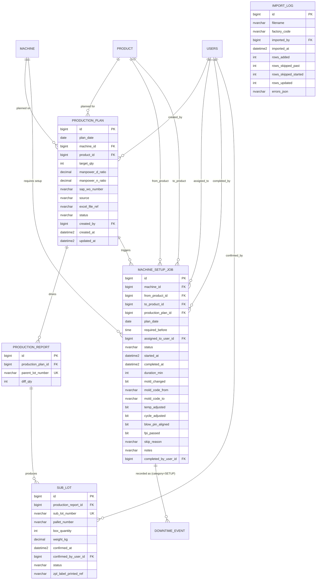

# Lot / Sub-Lot Hierarchy — Entity-Relationship Design

**Phase 1 · W9 · M3 deliverable**  
Status: Design only — implementation begins W10.

---

## ER Diagram



---

## Field Tables — New Entities

### PRODUCTION_PLAN

| Column | Type | Nullable | Default | Notes |
|---|---|---|---|---|
| `id` | `BIGINT IDENTITY(1,1)` | NO | — | PK |
| `plan_date` | `DATE` | NO | — | |
| `machine_id` | `BIGINT` | NO | — | FK → `machine(id)` |
| `product_id` | `BIGINT` | NO | — | FK → `product(id)` |
| `target_qty` | `INT` | NO | — | From Excel cell value |
| `manpower_d_ratio` | `DECIMAL(5,2)` | NO | `0.50` | Day shift split (0–1) |
| `manpower_n_ratio` | `DECIMAL(5,2)` | NO | `0.50` | Night shift split (0–1) |
| `sap_wo_number` | `NVARCHAR(50)` | YES | NULL | SAP WO reference |
| `source` | `NVARCHAR(20)` | NO | — | `'manual'` or `'excel_import'` |
| `excel_file_ref` | `NVARCHAR(200)` | YES | NULL | Original filename |
| `status` | `NVARCHAR(20)` | NO | `'draft'` | `draft` / `confirmed` / `archived` |
| `created_by` | `BIGINT` | NO | — | FK → `users(id)` |
| `created_at` | `DATETIME2` | NO | `SYSUTCDATETIME()` | |
| `updated_at` | `DATETIME2` | NO | `SYSUTCDATETIME()` | |

**Constraints:**
- `CONSTRAINT pk_production_plan PRIMARY KEY (id)`
- `CONSTRAINT uk_production_plan_machine_date_product UNIQUE (machine_id, plan_date, product_id)`
- `CONSTRAINT fk_production_plan_machine FOREIGN KEY (machine_id) REFERENCES machine(id)`
- `CONSTRAINT fk_production_plan_product FOREIGN KEY (product_id) REFERENCES product(id)`
- `CONSTRAINT fk_production_plan_created_by FOREIGN KEY (created_by) REFERENCES users(id)`

---

### MACHINE_SETUP_JOB

| Column | Type | Nullable | Default | Notes |
|---|---|---|---|---|
| `id` | `BIGINT IDENTITY(1,1)` | NO | — | PK |
| `machine_id` | `BIGINT` | NO | — | FK → `machine(id)` |
| `from_product_id` | `BIGINT` | YES | NULL | NULL = first plan for machine |
| `to_product_id` | `BIGINT` | NO | — | FK → `product(id)` |
| `production_plan_id` | `BIGINT` | NO | — | FK → `production_plan(id)` |
| `plan_date` | `DATE` | NO | — | Denormalized for query performance |
| `required_before` | `TIME` | YES | NULL | 07:00 D-shift / 19:00 N-shift |
| `assigned_to_user_id` | `BIGINT` | YES | NULL | FK → `users(id)` (Technician) |
| `status` | `NVARCHAR(20)` | NO | `'PENDING'` | See status values below |
| `started_at` | `DATETIME2` | YES | NULL | |
| `completed_at` | `DATETIME2` | YES | NULL | |
| `duration_min` | `INT` | YES | NULL | Computed from timestamps |
| `mold_changed` | `BIT` | NO | `0` | |
| `mold_code_from` | `NVARCHAR(50)` | YES | NULL | |
| `mold_code_to` | `NVARCHAR(50)` | YES | NULL | |
| `temp_adjusted` | `BIT` | NO | `0` | |
| `cycle_adjusted` | `BIT` | NO | `0` | |
| `blow_pin_aligned` | `BIT` | NO | `0` | |
| `fpi_passed` | `BIT` | NO | `0` | First-piece inspection |
| `skip_reason` | `NVARCHAR(500)` | YES | NULL | Required when status = SKIPPED |
| `notes` | `NVARCHAR(MAX)` | YES | NULL | |
| `completed_by_user_id` | `BIGINT` | YES | NULL | FK → `users(id)` |

**Status values:** `PENDING` / `IN_PROGRESS` / `COMPLETED` / `SKIPPED` / `SUPERSEDED`

**Constraints:**
- `CONSTRAINT pk_machine_setup_job PRIMARY KEY (id)`
- `CONSTRAINT fk_msj_machine FOREIGN KEY (machine_id) REFERENCES machine(id)`
- `CONSTRAINT fk_msj_from_product FOREIGN KEY (from_product_id) REFERENCES product(id)`
- `CONSTRAINT fk_msj_to_product FOREIGN KEY (to_product_id) REFERENCES product(id)`
- `CONSTRAINT fk_msj_plan FOREIGN KEY (production_plan_id) REFERENCES production_plan(id)`
- `CONSTRAINT fk_msj_assigned FOREIGN KEY (assigned_to_user_id) REFERENCES users(id)`
- `CONSTRAINT fk_msj_completed_by FOREIGN KEY (completed_by_user_id) REFERENCES users(id)`

---

### SUB_LOT

| Column | Type | Nullable | Default | Notes |
|---|---|---|---|---|
| `id` | `BIGINT IDENTITY(1,1)` | NO | — | PK |
| `production_report_id` | `BIGINT` | NO | — | FK → `production_reports(id)` |
| `sub_lot_number` | `NVARCHAR(100)` | NO | — | System-generated; globally unique |
| `pallet_number` | `NVARCHAR(50)` | YES | NULL | Groups multiple boxes |
| `box_quantity` | `INT` | NO | — | Pcs per box (e.g. 600) |
| `weight_kg` | `DECIMAL(10,3)` | YES | NULL | Gross weight |
| `confirmed_at` | `DATETIME2` | NO | `SYSUTCDATETIME()` | |
| `confirmed_by_user_id` | `BIGINT` | NO | — | FK → `users(id)` (Operator) |
| `status` | `NVARCHAR(20)` | NO | `'draft'` | `draft` / `confirmed` / `voided` |
| `zpl_label_printed_ref` | `NVARCHAR(100)` | YES | NULL | Print job reference |

**Constraints:**
- `CONSTRAINT pk_sub_lot PRIMARY KEY (id)`
- `CONSTRAINT uk_sub_lot_number UNIQUE (sub_lot_number)`
- `CONSTRAINT fk_sub_lot_report FOREIGN KEY (production_report_id) REFERENCES production_reports(id)`
- `CONSTRAINT fk_sub_lot_confirmed_by FOREIGN KEY (confirmed_by_user_id) REFERENCES users(id)`

---

### IMPORT_LOG

| Column | Type | Nullable | Default | Notes |
|---|---|---|---|---|
| `id` | `BIGINT IDENTITY(1,1)` | NO | — | PK |
| `filename` | `NVARCHAR(200)` | NO | — | |
| `factory_code` | `NVARCHAR(20)` | YES | NULL | TAHARA / ASB |
| `imported_by` | `BIGINT` | NO | — | FK → `users(id)` |
| `imported_at` | `DATETIME2` | NO | `SYSUTCDATETIME()` | |
| `rows_added` | `INT` | NO | `0` | |
| `rows_skipped_past` | `INT` | NO | `0` | plan_date < today |
| `rows_skipped_started` | `INT` | NO | `0` | report already exists for today |
| `rows_updated` | `INT` | NO | `0` | |
| `errors_json` | `NVARCHAR(MAX)` | YES | NULL | Per-row validation errors |

---

## Fields Added to Existing PRODUCTION_REPORT (W10)

| Column | Type | Nullable | Default | Notes |
|---|---|---|---|---|
| `production_plan_id` | `BIGINT` | YES | NULL | FK → `production_plan(id)`; NULL for historical |
| `parent_lot_number` | `NVARCHAR(100)` | YES | NULL | Globally unique; NULL for historical |
| `diff_qty` | `AS (ISNULL(actual_qty,0) - ISNULL(target_qty,0)) PERSISTED` | — | — | Computed column |

---

## Indexes

```sql
-- production_plan
CREATE INDEX idx_pp_machine_date ON production_plan (machine_id, plan_date);
CREATE INDEX idx_pp_status      ON production_plan (status);

-- machine_setup_job
CREATE INDEX idx_msj_machine_date    ON machine_setup_job (machine_id, plan_date);
CREATE INDEX idx_msj_assigned_status ON machine_setup_job (assigned_to_user_id, status);
CREATE INDEX idx_msj_status          ON machine_setup_job (status);

-- sub_lot
CREATE INDEX idx_sl_report  ON sub_lot (production_report_id);
CREATE INDEX idx_sl_pallet  ON sub_lot (pallet_number);

-- production_reports (added in V7)
CREATE UNIQUE INDEX idx_pr_parent_lot ON production_reports (parent_lot_number)
    WHERE parent_lot_number IS NOT NULL;
```

---

## Naming Conventions

### Parent Lot Number (`parent_lot_number`)

**Format:** `PL-{machine_code}-{YYYYMMDD}-{shift}`

| Token | Description | Example |
|---|---|---|
| `PL` | Fixed prefix | `PL` |
| `{machine_code}` | Machine name from master | `RBL101` |
| `{YYYYMMDD}` | Plan date | `20251001` |
| `{shift}` | `D` (day 06:00–18:00) or `N` (night 18:00–06:00) | `D` |

**Example:** `PL-RBL101-20251001-D`

### Sub-Lot Number (`sub_lot_number`)

**Format:** `{parent_lot_number}-B{seq:04d}`

**Example:** `PL-RBL101-20251001-D-B0001`

Sequence is per parent lot, starting at 1, padded to 4 digits. Generated atomically by service layer (see `sub-lot-numbering.md`).

### Pallet Number (`pallet_number`)

**Format:** `{parent_lot_number}-PLT{seq:02d}`

**Example:** `PL-RBL101-20251001-D-PLT01`

Multiple sub-lot boxes share one pallet number. Operator assigns pallet during box confirmation.
